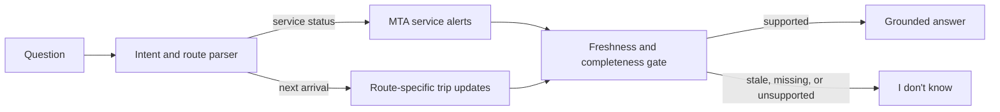

# TransitGuard

Evidence-gated question answering for New York City subway status and arrivals.

TransitGuard solves one narrow problem: **a real-time assistant should not answer a transit question when its evidence is missing or stale**. It routes each supported question to the relevant MTA GTFS-Realtime feed, validates freshness and required fields, and returns either a grounded answer or an explicit abstention. An optional local Ollama model can parse varied user language, but it never supplies transit facts.

## Why this project exists

Small language models often turn an old schedule or incomplete service notice into a confident answer. For transit, that failure is immediately harmful. TransitGuard puts a deterministic evidence gate between retrieval and generation:



The project intentionally does not use a vector database, multi-agent workflow, general web search, or LLM self-verification. Official MTA trip updates supply structured evidence; official service alerts supply retrieved natural-language evidence. The source router selects only what the question needs. Final factual responses use deterministic templates so an LLM cannot alter a verified route, time, or alert.

## Supported scope

TransitGuard currently supports two question types:

1. Subway service status: `Is the A train delayed?`
2. Next arrival with a GTFS stop ID: `When is the next 7 train? --stop-id 725N`

It abstains when:

- the question is outside this scope;
- the subway route or required stop ID is missing;
- the feed is more than 90 seconds old;
- the feed timestamp is invalid;
- no matching future arrival exists;
- an alert lacks usable text.

## Quick start

Python 3.10 or newer is required.

```bash
python -m venv .venv
source .venv/bin/activate
pip install .
```

Ask the live MTA feeds:

```bash
transitguard ask "Is the A train delayed?"
transitguard ask "When is the next 7 train?" --stop-id 725N
```

For more varied phrasing, use a running local Ollama instance as a constrained parser:

```bash
transitguard ask "How long until the uptown 7 gets here?" \
  --stop-id 725N \
  --ollama-parser
```

Run a deterministic offline example without installing the GTFS dependency:

```bash
python -m transitguard ask "Is the A train delayed?" \
  --fixture data/demo_snapshot.json \
  --now 2026-08-11T14:00:30+00:00
```

The output includes the decision, reason, source, and evidence timestamp:

```json
{
  "answer": "A trains are running with delays in both directions.",
  "abstained": false,
  "reason": "active_service_alert",
  "source": "fixture://mta-demo",
  "observed_at": "2026-08-11T14:00:00+00:00"
}
```

## Evaluation

The bundled evaluation checks supported answers and deliberate abstentions under fresh, stale, missing, and out-of-scope evidence conditions:

```bash
python -m transitguard evaluate
python -m unittest discover -s tests -v
```

Reported metrics:

- answer-level accuracy;
- abstention precision;
- abstention recall.

The included six-case fixture is a smoke test, not a benchmark. Resume claims should use results from a larger, time-split dataset collected from archived MTA feeds.

## Design

```text
transitguard/
├── router.py      # constrained intent and route parsing
├── ollama.py      # optional local-model parser with schema validation
├── mta.py         # GTFS-Realtime retrieval and protobuf parsing
├── cache.py       # SQLite feed cache and outage fallback
├── gate.py        # freshness, completeness, and scope checks
├── pipeline.py    # orchestration
├── evaluate.py    # reproducible offline evaluation
└── cli.py         # command-line interface
```

MTA responses are cached in SQLite. A network failure can reuse the last payload, but the evidence gate still rejects it once its embedded feed timestamp exceeds the freshness threshold. Availability never overrides correctness.

## Data sources

- [MTA GTFS-Realtime reference](https://api.mta.info/GTFS.pdf)
- [MTA Open Data](https://www.mta.info/open-data)
- [GTFS-Realtime reference](https://gtfs.org/documentation/realtime/reference/)
- [GTFS-Realtime best practices](https://gtfs.org/documentation/realtime/realtime-best-practices/)

TransitGuard is not affiliated with the MTA. Do not treat its output as a substitute for official MTA guidance.

## Resume description

> Built an evidence-gated question-answering pipeline over MTA GTFS-Realtime feeds that dynamically routes subway status and arrival queries, validates evidence freshness, and abstains on stale or incomplete data. Added SQLite feed caching and a reproducible evaluation harness for answer accuracy and abstention quality.

Replace this description with measured results only after evaluating on a larger dataset.
